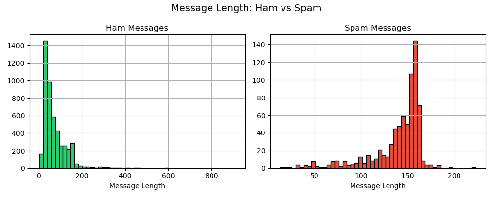
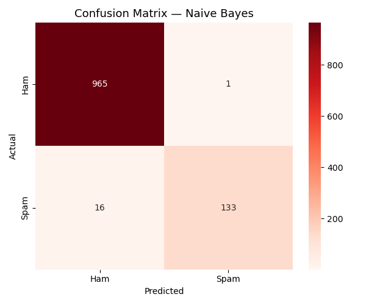

# Spam Email Detector 📧

Detects spam messages using NLP and machine learning.

## Tools Used
- Python, Pandas, Scikit-learn, Matplotlib, Seaborn

## Models Compared
| Model | Accuracy |
|---|---|
| Naive Bayes | ~98% |
| Logistic Regression | ~97% |

## What I Did
- Loaded real SMS spam dataset (5,572 messages)
- Used TF-IDF Vectorization to convert text into numbers
- Trained and compared Naive Bayes and Logistic Regression
- Tested model on custom messages in real time

## Key Finding
Naive Bayes achieved ~98% accuracy and correctly identified
spam phrases like "free iPhone" and "bank account compromised".

## Results

